## Introduction
Welcome to Da-Chat WhatsApp Analyzer!
WhatsApp (by META) is reported to have more than 2 billion monthly active users globally, a huge amount of users that allows META to learn our usage and communication patterns.
Now, thanks to Da-Chat, we too can enjoy the information that we and our friends generate on WhatsApp!
The nice folks over at WhatsApp gave us a feature that allows you to export a chat, BUT, let's be honest, this TXT file is incomprehensible to humans.
This is where DaChat comes into the picture and generates a detailed PDF report for you, the user, that includes plots describing trends and stats in the group.
Who are the most active participants?
When of the day and week is the group most active?
How many people joined and left the group over time?
What is the participants engagement level?
And for you data geeks (you know who you are..), if you are interested in continuing to explore the data, DaChat will save the processed information in a clean and tidy CSV file this is the first and critical step for producing quality analyses.

# Example

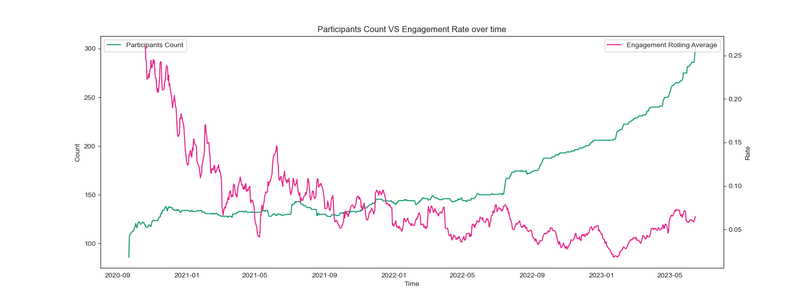
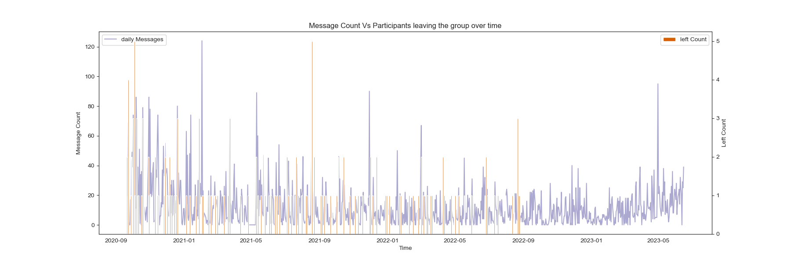
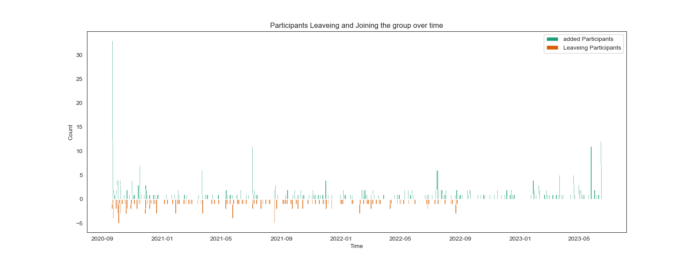
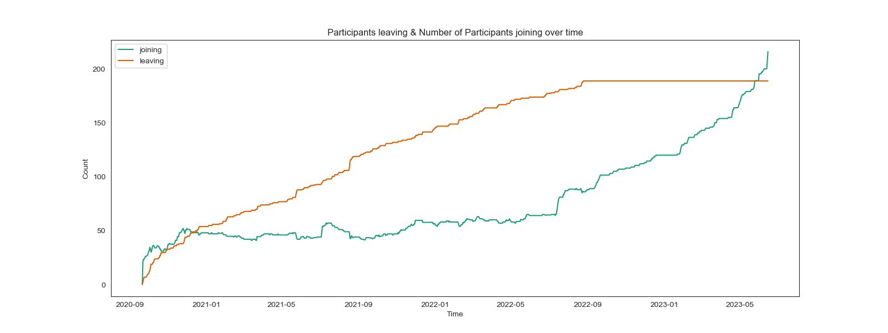
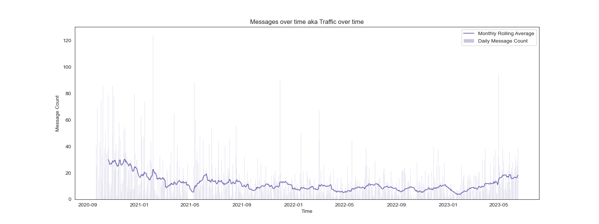
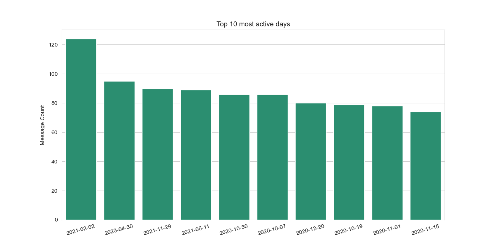
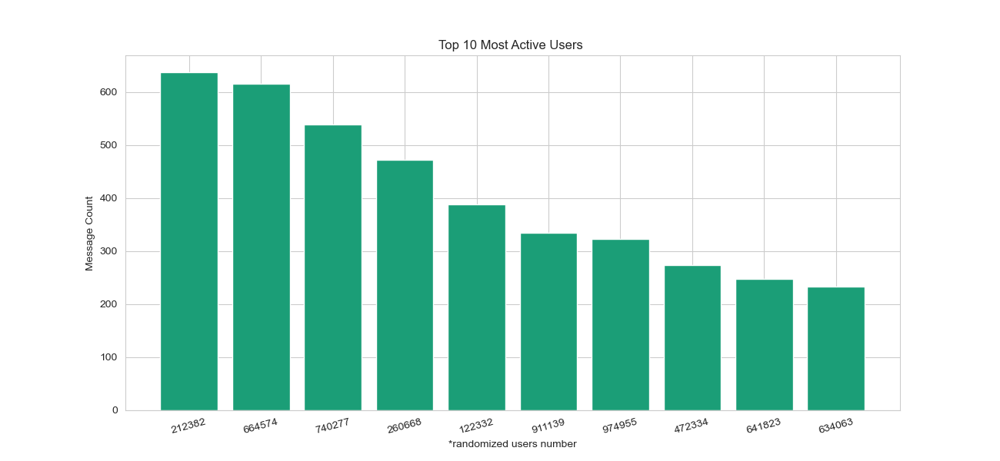
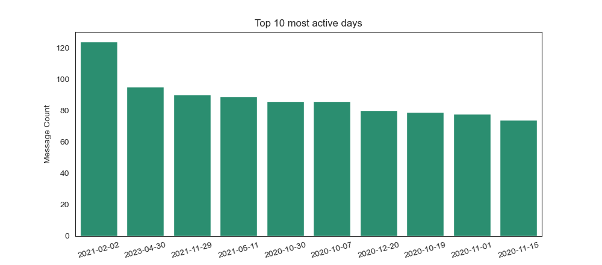
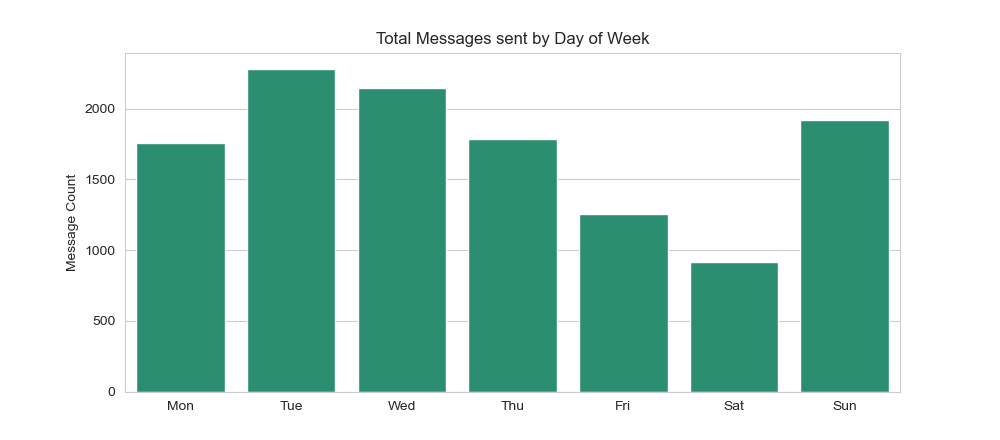
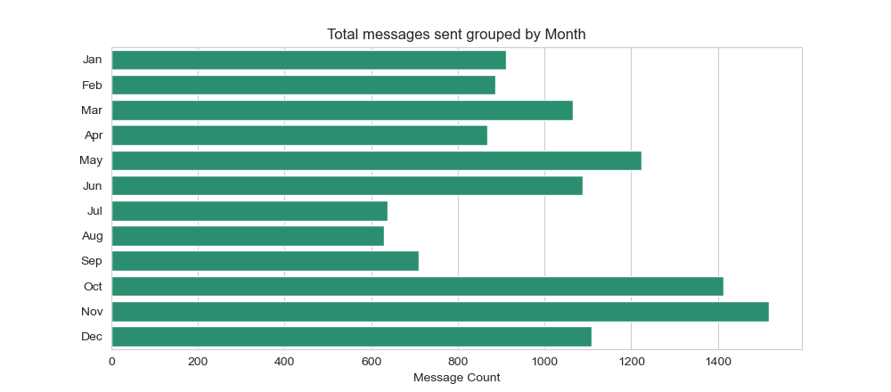
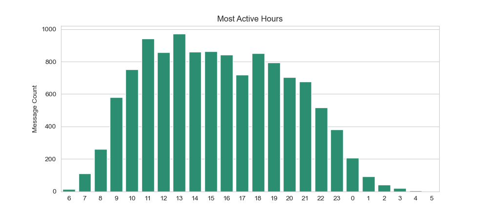

# How to Install Da-Chat?
It is advisable to make a new virtual environment (with python 3.6) for this project. Step-by-Step  
details on creating a virtual environment can be found [here](https://towardsdatascience.com/setting-up-python-platform-for-machine-learning-projects-cfd85682c54b)


## Clone the repository
Once you have created the virtual environment, activate it and use the following command.
```
git clone https://github.com/shalomhalf/DaChat
```

## Install required packages
```
cd DaChat
pip install -r requirements.txt
```

# How to run AnalyzeTheChat?
## Export the WhatsApp chat
Export the WhatsApp chat you like to analyze using the following steps
1. Open the WhatsApp chat
2. Click the three vertical dots on top-right
3. Click More
4. Click Export Chat
5. Click Without Media
6. Save the generated .txt file where it is accessible


## Run Da-Chat!
```
python dachat.py
```

Da-Chat will ask you for several details:
1. The path to the file
2. The format of the hours as it appears in the file (24hr / 12hr)
3. A secondary category of your choice
4. The number of users at the time the file was downloaded
5. DaChat will save a detailed graphic analysis on your computer, enjoy!

# Coming Soon
We are working on improving the analysis design, stay tuned..