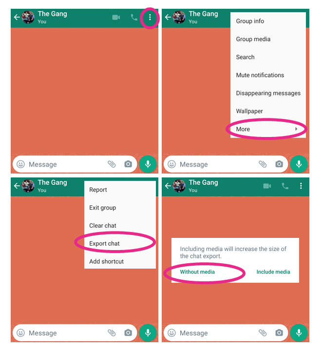

# whatsapp_chat_summary
Python software that summarizes WhatsApp group data
As part of a project I am doing for a large municipality, I am interested in analyzing trends & phenomenas in "neighborhood" WhatsApp groups (in a district chosen by the municipality).
This app allows me to convert raw information exported from WhatsApp into a Pandas Datd Frames and at the same time process the "group notifications" in a way that allows me to reverse engineer information about leaving and joining participants.

User please note:
The software is adapted to raw information downloaded from WhatsApp in English settings, the information structure may vary if it is downloaded from WhatsApp in another language settings.
It is important to check the number of participants in the group chat when exporting the information from WhatsApp, since this information is not included in the raw file the app needs it for optimal use.


NEW:
)
## Introduction
Welcome to Da-Chat WhatsApp Analyzer!
WhatsApp (by META) is reported to have more than 2 billion monthly active users globally, a huge amount of users that allows META to learn our usage and communication patterns.
Now, thanks to Da-Chat, we too can enjoy the information that we and our friends generate on WhatsApp!
The nice folks over at WhatsApp gave us a feature that allows you to export a chat, but the format is not very usable, so in V1, the user can convert the TXT file to a neat and clean CSV, with the help of a little reverse engineering, the software also produces missing information such as the number of participants and leavers over time.
Organized and clean information is the first and critical step for producing quality analyses.


# How to Install Da-Chat?
It is advisable to make a new virtual environment (with python 3.6) for this project. Step-by-Step  
details on creating a virtual environment can be found [here](https://towardsdatascience.com/setting-up-python-platform-for-machine-learning-projects-cfd85682c54b)


## Clone the repository
Once you have created the virtual environment, activate it and use the following command.
```
git clone https://github.com/shalomhalf/DaChat
```

## Install required packages
```
cd DaChat
pip install -r requirements.txt
```

# How to run AnalyzeTheChat?
## Export the WhatsApp chat
Export the WhatsApp chat you like to analyze using the following steps
1. Open the WhatsApp chat
2. Click the three vertical dots on top-right
3. Click More
4. Click Export Chat
5. Click Without Media
6. Save the generated .txt file where it is accessible



## Run Da-Chat!
```
python dachat.py
```

Da-Chat will ask you for several details:
1. The path to the file
2. The format of the hours as it appears in the file (24hr / 12hr)
3. A secondary category of your choice
4. The number of users at the time the file was downloaded


# Coming Soon
In the next update, the user will be able to receive an automatic report on the usage patterns of the group - activity volume over time, engagement over time, the hot activity times of the week and year, who are the heavy users and more!